<div align="center">

<!-- ═══════════════════════════════════════════════════════════════════ -->
<!-- ██  BIOMETRIC ACCESS GATEWAY                                   ██ -->
<!-- ═══════════════════════════════════════════════════════════════════ -->

<picture>
  <source media="(prefers-color-scheme: dark)" srcset="assets/fingerprint-scan.svg">
  <source media="(prefers-color-scheme: light)" srcset="assets/fingerprint-scan.svg">
  
</picture>

<br><br>

```
╔══════════════════════════════════════════════════════════════════════╗
║                                                                      ║
║   ███████╗███████╗███╗   ██╗████████╗██╗███╗   ██╗███████╗██╗       ║
║   ██╔════╝██╔════╝████╗  ██║╚══██╔══╝██║████╗  ██║██╔════╝██║       ║
║   ███████╗█████╗  ██╔██╗ ██║   ██║   ██║██╔██╗ ██║█████╗  ██║       ║
║   ╚════██║██╔══╝  ██║╚██╗██║   ██║   ██║██║╚██╗██║██╔══╝  ██║       ║
║   ███████║███████╗██║ ╚████║   ██║   ██║██║ ╚████║███████╗███████╗  ║
║   ╚══════╝╚══════╝╚═╝  ╚═══╝   ╚═╝   ╚═╝╚═╝  ╚═══╝╚══════╝╚══════╝  ║
║                            ██╗  ██╗                                  ║
║                            ╚██╗██╔╝                                  ║
║                             ╚███╔╝                                   ║
║                             ██╔██╗                                   ║
║                            ██╔╝ ██╗                                  ║
║                            ╚═╝  ╚═╝                                  ║
║                                                                      ║
║              T H E   F O R E N S I C   G U A R D                    ║
║                                                                      ║
╚══════════════════════════════════════════════════════════════════════╝
```

<br>


&nbsp;

&nbsp;


<br><br>


<br><br>

<table>
<tr>
<td width="100%" align="center">

```
┌─────────────────────────────────────────────────────────────────┐
│  AI-Powered Transaction Forensics for Institutional Finance     │
│  Built for JP Morgan's Kinexys Division — detecting synthetic   │
│  AI entities across institutional transaction networks.         │
│                                                                 │
│  When every transaction could be a ghost, SENTINEL-X sees       │
│  through the noise.                                             │
└─────────────────────────────────────────────────────────────────┘
```

</td>
</tr>
</table>

</div>

---

<div align="center">

```
▓▓▓▓▓▓▓▓▓▓▓▓▓▓▓▓▓▓▓▓▓▓▓▓▓▓▓▓▓▓▓▓▓▓▓▓▓▓▓▓▓▓▓▓▓▓▓▓▓▓▓▓▓▓▓▓▓▓▓▓
█                                                                █
█   ⚠  SECURITY CLEARANCE VERIFICATION REQUIRED  ⚠              █
█      EXPAND SECTIONS BELOW TO ACCESS DOSSIER                  █
█                                                                █
▓▓▓▓▓▓▓▓▓▓▓▓▓▓▓▓▓▓▓▓▓▓▓▓▓▓▓▓▓▓▓▓▓▓▓▓▓▓▓▓▓▓▓▓▓▓▓▓▓▓▓▓▓▓▓▓▓▓▓▓
```

</div>

<br>

<!-- ═══════════════════════════════════════════════════════════════════ -->
<!-- ██  CLEARANCE LEVEL 1 — PROJECT VISION                        ██ -->
<!-- ═══════════════════════════════════════════════════════════════════ -->

<details>
<summary>
<h3>🔓 CLEARANCE LEVEL 1 — PROJECT VISION &nbsp; <code>[UNCLASSIFIED]</code></h3>
</summary>

<br>

<div align="center">

```
┌─── MISSION BRIEFING ─────────────────────────────────────────────────┐
│                                                                       │
│   CODENAME:    SENTINEL-X                                            │
│   SECTOR:      Institutional Financial Crime Intelligence            │
│   PRINCIPAL:   JP Morgan — Kinexys Division                          │
│   THREAT:      Synthetic AI-Generated Transaction Entities           │
│   MANDATE:     Detect. Classify. Report. Neutralize.                 │
│                                                                       │
└───────────────────────────────────────────────────────────────────────┘
```

</div>

<br>

<table>
<tr>
<td>

#### 🎯 &nbsp; THE PROBLEM

The next frontier of financial fraud isn't human — it's **synthetic**. AI-generated entities are creating transaction patterns indistinguishable from legitimate institutional activity. Traditional KYC/AML systems are blind to them.

#### 🛡️ &nbsp; THE SOLUTION

**SENTINEL-X** is a forensic intelligence platform that treats every transaction as a potential threat vector. Using biometric telemetry analysis, behavioral fingerprinting, and network topology forensics, it classifies entities as **HUMAN** or **SYNTHETIC AI** — then generates institutional-grade dossiers for compliance teams.

#### 🔮 &nbsp; THE VISION

A world where no synthetic entity can masquerade as a human in institutional finance. SENTINEL-X is the watchtower — an always-on forensic perimeter that turns raw transaction data into actionable intelligence.

</td>
</tr>
</table>

<br>

<div align="center">

| CAPABILITY | DESCRIPTION | STATUS |
|:---:|:---|:---:|
| 🏦 | **Kinexys Transaction Feed** — Real-time simulated institutional transaction monitoring | `● LIVE` |
| 🕵️ | **Detective Engine** — AI entity classification via biometric telemetry signals | `● LIVE` |
| 📄 | **Forensic Dossier** — High-fidelity PDF report generation for flagged entities | `● LIVE` |
| 🔐 | **Biometric Entry Portal** — Secure-access landing with liveness scan simulation | `● LIVE` |
| 🧬 | **Behavioral Telemetry** — Keystroke dynamics, mouse entropy, session biometrics | `● LIVE` |
| 🌐 | **Network Forensics** — Graph-based transaction topology analysis | `● LIVE` |
| 🪪 | **Identity Proof Engine** — Multi-factor entity verification scoring | `● LIVE` |

</div>

<br>

</details>

<!-- ═══════════════════════════════════════════════════════════════════ -->
<!-- ██  CLEARANCE LEVEL 2 — TECH STACK                             ██ -->
<!-- ═══════════════════════════════════════════════════════════════════ -->

<details>
<summary>
<h3>🔐 CLEARANCE LEVEL 2 — TECHNICAL ARCHITECTURE &nbsp; <code>[CONFIDENTIAL]</code></h3>
</summary>

<br>

<div align="center">

```
┌─── SYSTEM ARCHITECTURE ──────────────────────────────────────────────┐
│                                                                       │
│   ┌──────────┐     ┌──────────────┐     ┌──────────────────┐        │
│   │ BIOMETRIC │────▶│  DETECTIVE   │────▶│  FORENSIC        │        │
│   │ GATEWAY   │     │  ENGINE      │     │  DOSSIER GEN     │        │
│   └──────────┘     └──────────────┘     └──────────────────┘        │
│        │                  │                       │                   │
│        ▼                  ▼                       ▼                   │
│   ┌──────────┐     ┌──────────────┐     ┌──────────────────┐        │
│   │ LIVENESS │     │  BEHAVIORAL  │     │  PDF EXPORT      │        │
│   │ SCAN     │     │  TELEMETRY   │     │  (jsPDF)         │        │
│   └──────────┘     └──────────────┘     └──────────────────┘        │
│                                                                       │
│   FRAMEWORK:  Next.js 16 (App Router)  │  RUNTIME: React 19         │
│   STYLING:    Tailwind CSS v4          │  ICONS:   Lucide            │
│   REPORTS:    jsPDF + AutoTable        │  LANG:    TypeScript        │
│                                                                       │
└───────────────────────────────────────────────────────────────────────┘
```

</div>

<br>

<table>
<tr><td>

<div align="center">

#### ⚙️ &nbsp; CORE STACK

</div>

| LAYER | TECHNOLOGY | VERSION | PURPOSE |
|:---:|:---|:---:|:---|
| 🧱 | **Next.js** | `16.2.10` | App Router, SSR, RSC architecture |
| ⚛️ | **React** | `19.2.4` | Concurrent rendering, Suspense boundaries |
| 🔷 | **TypeScript** | `^5` | End-to-end type safety across all modules |
| 🎨 | **Tailwind CSS** | `v4` | Utility-first design system with CSS-native config |
| 📊 | **jsPDF** | `4.2.1` | Client-side forensic PDF report generation |
| 📋 | **jsPDF-AutoTable** | `5.0.8` | Structured data tables in forensic dossiers |
| 🎯 | **Lucide Icons** | `1.25.0` | Consistent iconography across the interface |

</td></tr>
</table>

<br>

<div align="center">

#### 🎨 &nbsp; DESIGN TOKEN SYSTEM

</div>

<table>
<tr>
<td align="center" width="20%">
<br>
<br>
<code>OBSIDIAN</code><br>
<code>#0A0A0A</code><br>
<sub>Primary Background</sub><br><br>
</td>
<td align="center" width="20%">
<br>
<br>
<code>VERMILION</code><br>
<code>#E63946</code><br>
<sub>Alerts & Threats</sub><br><br>
</td>
<td align="center" width="20%">
<br>
<br>
<code>EMERALD</code><br>
<code>#10B981</code><br>
<sub>Verified & Safe</sub><br><br>
</td>
<td align="center" width="20%">
<br>
<br>
<code>AMBER</code><br>
<code>#F59E0B</code><br>
<sub>Warnings</sub><br><br>
</td>
<td align="center" width="20%">
<br>
<br>
<code>OFF-WHITE</code><br>
<code>#FCFAF9</code><br>
<sub>Primary Text</sub><br><br>
</td>
</tr>
</table>

<br>

<div align="center">

#### 📂 &nbsp; PROJECT STRUCTURE

</div>

```
sentinel-x/
├── src/
│   ├── app/
│   │   ├── layout.tsx          # Root layout — global fonts, metadata
│   │   ├── page.tsx            # Entry point — orchestrates views
│   │   └── globals.css         # Tailwind v4 + custom forensic animations
│   ├── components/
│   │   ├── LandingPage.tsx     # Biometric gateway + 6-digit access code
│   │   ├── Dashboard.tsx       # Kinexys transaction feed + detective engine
│   │   └── TransactionRow.tsx  # Individual entity row with threat scoring
│   └── lib/
│       ├── types.ts            # Core type definitions (Entity, Transaction)
│       ├── mock-data.ts        # Deep forensic mock data generators
│       └── pdf-generator.ts   # jsPDF forensic dossier builder
├── assets/
│   └── fingerprint-scan.svg   # Animated biometric scan visual
├── tailwind.config.ts         # Design token configuration
├── next.config.ts             # Next.js 16 configuration
├── tsconfig.json              # TypeScript strict mode config
└── package.json               # Dependencies & scripts
```

<br>

</details>

<!-- ═══════════════════════════════════════════════════════════════════ -->
<!-- ██  CLEARANCE LEVEL 3 — FORENSIC AUDIT LOGIC                   ██ -->
<!-- ═══════════════════════════════════════════════════════════════════ -->

<details>
<summary>
<h3>🔏 CLEARANCE LEVEL 3 — FORENSIC AUDIT LOGIC &nbsp; <code>[TOP SECRET]</code></h3>
</summary>

<br>

<div align="center">

```
┌─── THREAT MODEL ─────────────────────────────────────────────────────┐
│                                                                       │
│   ENTITY ENTERS SYSTEM                                               │
│          │                                                            │
│          ▼                                                            │
│   ┌──────────────────┐                                               │
│   │  BIOMETRIC SCAN  │◀── Keystroke Dynamics                         │
│   │  (Liveness Check)│◀── Mouse Movement Entropy                     │
│   └────────┬─────────┘◀── Session Fingerprint                        │
│            │                                                          │
│            ▼                                                          │
│   ┌──────────────────┐                                               │
│   │  BEHAVIORAL      │◀── Transaction Velocity Analysis              │
│   │  TELEMETRY       │◀── Amount Distribution Patterns               │
│   └────────┬─────────┘◀── Temporal Anomaly Detection                 │
│            │                                                          │
│            ▼                                                          │
│   ┌──────────────────┐                                               │
│   │  NETWORK         │◀── Graph Topology Mapping                     │
│   │  FORENSICS       │◀── Counterparty Clustering                    │
│   └────────┬─────────┘◀── Shell Entity Detection                     │
│            │                                                          │
│            ▼                                                          │
│   ┌──────────────────┐                                               │
│   │  CLASSIFICATION  │──▶ HUMAN ✅  or  SYNTHETIC AI ⛔              │
│   └────────┬─────────┘                                               │
│            │                                                          │
│            ▼                                                          │
│   ┌──────────────────┐                                               │
│   │  FORENSIC DOSSIER│──▶ PDF Export (jsPDF + AutoTable)             │
│   │  GENERATION      │──▶ Compliance-Ready Report                    │
│   └──────────────────┘                                               │
│                                                                       │
└───────────────────────────────────────────────────────────────────────┘
```

</div>

<br>

<table>
<tr><td>

#### 🧬 &nbsp; DETECTION METHODOLOGY

**Phase 1 — Biometric Liveness Scan**
> The entry portal simulates a biometric authentication sequence. A 6-digit access code combined with a liveness scan animation establishes the UX tone: *this is not a dashboard — this is an investigation terminal.*

**Phase 2 — Behavioral Telemetry Analysis**
> Each entity's transaction behavior is decomposed into telemetry signals:
> - **Keystroke Cadence** — Synthetic entities exhibit statistically uniform inter-key timing
> - **Mouse Entropy** — AI-driven sessions show deterministic cursor trajectories
> - **Session Duration** — Non-human actors demonstrate anomalous session persistence patterns

**Phase 3 — Network Forensics**
> Transaction graphs reveal what individual signals cannot:
> - **Counterparty Clustering** — Shell entities form distinct graph topologies
> - **Velocity Spikes** — Coordinated burst patterns across synthetic networks
> - **Amount Distribution** — AI entities favor round numbers and geometric progressions

**Phase 4 — Classification & Reporting**
> The detective engine assigns a final classification:
> - `VERDICT: HUMAN` — Entity cleared with confidence score
> - `VERDICT: SYNTHETIC_AI` — Entity flagged with forensic evidence chain
>
> Flagged entities trigger **Forensic Dossier Generation** — a structured PDF containing all telemetry data, network analysis, and classification rationale. Built with jsPDF + AutoTable for institutional compliance standards.

</td></tr>
</table>

<br>

<div align="center">

#### 📊 &nbsp; SIGNAL ANALYSIS MATRIX

</div>

<table>
<tr>
<th align="center">SIGNAL</th>
<th align="center">HUMAN BASELINE</th>
<th align="center">SYNTHETIC ANOMALY</th>
<th align="center">WEIGHT</th>
</tr>
<tr>
<td><code>keystroke_cadence</code></td>
<td>Variable (80-200ms)</td>
<td>Uniform (±5ms variance)</td>
<td align="center"><code>0.25</code></td>
</tr>
<tr>
<td><code>mouse_entropy</code></td>
<td>High (Brownian)</td>
<td>Low (Linear/Bézier)</td>
<td align="center"><code>0.20</code></td>
</tr>
<tr>
<td><code>tx_velocity</code></td>
<td>Irregular bursts</td>
<td>Metronomic intervals</td>
<td align="center"><code>0.20</code></td>
</tr>
<tr>
<td><code>amount_distribution</code></td>
<td>Log-normal</td>
<td>Geometric/Round</td>
<td align="center"><code>0.15</code></td>
</tr>
<tr>
<td><code>session_fingerprint</code></td>
<td>Unique per session</td>
<td>Reused/Rotated</td>
<td align="center"><code>0.10</code></td>
</tr>
<tr>
<td><code>graph_topology</code></td>
<td>Organic clustering</td>
<td>Star/Hub patterns</td>
<td align="center"><code>0.10</code></td>
</tr>
</table>

<br>

</details>

<!-- ═══════════════════════════════════════════════════════════════════ -->
<!-- ██  DEPLOYMENT PROTOCOL                                        ██ -->
<!-- ═══════════════════════════════════════════════════════════════════ -->

---

<div align="center">

```
▓▓▓▓▓▓▓▓▓▓▓▓▓▓▓▓▓▓▓▓▓▓▓▓▓▓▓▓▓▓▓▓▓▓▓▓▓▓▓▓▓▓▓▓▓▓▓▓▓▓▓▓▓▓▓▓▓▓▓▓
█                                                                █
█              ⚡  DEPLOYMENT PROTOCOL  ⚡                       █
█                                                                █
▓▓▓▓▓▓▓▓▓▓▓▓▓▓▓▓▓▓▓▓▓▓▓▓▓▓▓▓▓▓▓▓▓▓▓▓▓▓▓▓▓▓▓▓▓▓▓▓▓▓▓▓▓▓▓▓▓▓▓▓
```

</div>

<br>

```bash
# ── INITIALIZE SECURE ENVIRONMENT ──────────────────────────────
$ git clone https://github.com/SayAn1-dls/sentinel-x.git
$ cd sentinel-x

# ── INSTALL DEPENDENCIES ──────────────────────────────────────
$ npm install

# ── LAUNCH FORENSIC TERMINAL ──────────────────────────────────
$ npm run dev

# ── ACCESS POINT ──────────────────────────────────────────────
# → http://localhost:3000
# → Enter 6-digit access code at biometric gateway
```

<br>

---

<div align="center">

```
┌─────────────────────────────────────────────────────────────────┐
│                                                                   │
│   "In a world where AI can fabricate identities at scale,         │
│    the question is no longer IF synthetic entities exist           │
│    in your transaction network — it's HOW MANY."                  │
│                                                                   │
│                              — SENTINEL-X Threat Assessment       │
│                                                                   │
└─────────────────────────────────────────────────────────────────┘
```

<br>


&nbsp;

&nbsp;


<br><br>

<sub>

```
═══════════════════════════════════════════════════════════════════
  © 2026 SENTINEL-X™  ·  JP Morgan Kinexys Forensic Operations
  CLASSIFICATION: CONFIDENTIAL  ·  FOR AUTHORIZED PERSONNEL ONLY
  ━━━━━━━━━━━━━━━━━━━━━━━━━━━━━━━━━━━━━━━━━━━━━━━━━━━━━━━━━━━━
  Engineered by Sayan  ·  Forensic Intelligence Division
═══════════════════════════════════════════════════════════════════
```

</sub>

</div>
